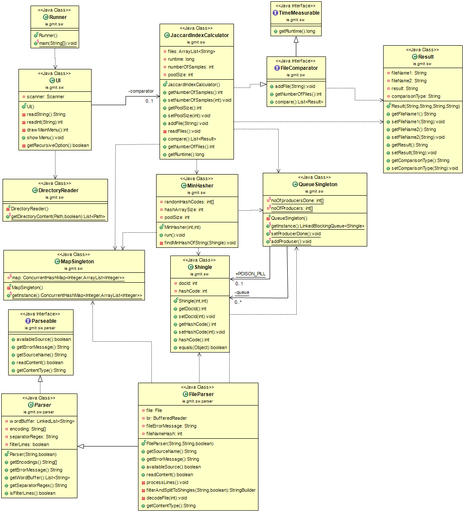

# Java-API-for-Measuring-Document-Similarity
The application is written in Java for Object Oriented Programming module in year 3 of Software Development(2017) course at Galway Mayo Institute of Technology, Galway Campus.

## What is it?
This applciation is a Jaccard Index Calculator. It is capable of comparing multiple files under one second(On a mid range computer)


## How to run


The application can be run with the following commands:

```
jar –cf oop.jar *


java –cp ./oop.jar ie.gmit.sw.Runner
```


## How to use:


Option 1 to add a new file for comparison. 
* Any amount of file can be added for comparison. Once a file is added beside the menu item will increase.

Option 2 to read files from a directory
* Read in all files from a directory. Provides an option for reading in recursively.
Option 3 to change the sample size. 
* The original sample size of for the comparison is set to 200. This size can be any between 1 and 2,147,483,646. How ever too large number will cause low Jaccard Index and too low wil cause high Jaccard Index

Option 4 to change the amount of consumer threads. 
* The original amount of consumer threads is set to 100. This size can be any between 1 and 2,147,483,646. How ever too large or too low number may slow down the application. An optimal number of threads should be created.

Option 5 to compare files.
* The files can be compared once at least two files are added with option 1. If a file is not available or could not be read then, the file is skipped and an error message is displayed. Until the comparison is finished the "The file comparisons started. Please wait..." message is shown. When the comparison is done, the file names and the Jaccard Indexes are displayed in the console along with the time it took to read the files and compare them.

## Design

### The application is designed in the producer-consumer pattern:
The file reader threads are puting the shingles onto the end of a QueueSingleton and the consumer threads created by the MinHasher are taking the shingles from the front of the queue.
### Shingle creation
The shingles are created by the file reader. The a BufferedrRader reads the file line by line. Each character in the line are checked:
 * If a character is not a letter, number or space then it is filtered out
 * Multiple spaces are collapsed into a single space
 * Every valid character is added to a StringBuilder
 * If a character is space, a space counter is incremented
 * When the space counter reaches the desired shingle size, the content of the String Builder is hash coded and in a from of a Shingle added to the QueueSingleton
 * Left over characters are added to the front of the next line.
 * If the last line is reached and there are not enought characters for a shingle, the shingle is created with the left over.
 * This whole thing could have been reached with 5-6 lines with the use of regexes, however I decided to implement my own filter as each regex (filter,space collase, trim) would add extra 50-100ms/file(because each line would be looped multiple times).
### MinHasher 
 * A fixed sized thread pool is consuming the elements of the Queue.
 * Each thread in the pool takes one element and generates the minhash of that element
 * MinHashes are stored in MapSingleton which is an implementatin of ConcurrentHashMap. This map has the keys as document id and an ArrayList for the minhashes.
 * A number of random integers are generated to create the minhashes. These random integers are looped with every shingle and the lowest is kept in MapSingeton.
 * The MinHaser runs untile a poison pill Shingle is reached. This shingle is added by the QueueSingleton once every file parser is "registred as finished"
### Jaccard Index Calculator
This class is a mediator for the file reader and the minhasher. The compare method of this class reads in the files in threads and starts the consumer threads of the Minhasher.
Calls the minhasher's "run" method. This method is a blocking method. Runs until every element is used from the Queue (which could be run method of Runnable. but in this case there was not much point to create a thread for creating more threads).
Once the run method is finished, every list in the MapSingleton is compared and their intersections are calculated. 
The Jaccard Index is calculated from the intersections of the lists and the size of the lists. The result is stored in a Result object. The Result objects are consumed by the UI to display them to the user.

### Logging
For logging I used SL4J which is set upt for debug and production environment.


### Class Diagram



## Dependencies

 * slf4j-api-1.7.21.jar
 * logback-core-1.2.3.jar
 * logback-classic-1.2.3.jar
